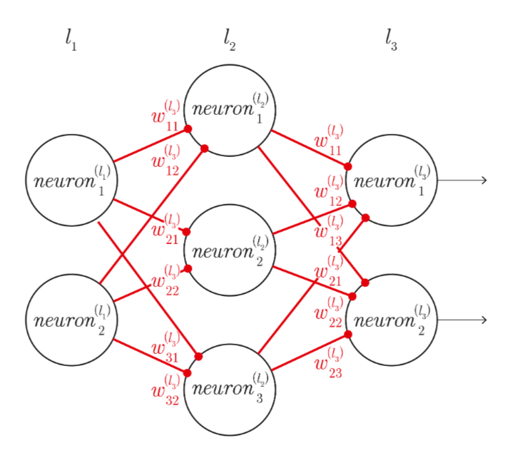

## **Problem**
We train a large feed forward neural network, larger than the size normally needed for the problem at hand, we formulate an MILP such that we prune as much of the network as possible while maintaining a large accuracy.

## **Notation**

Lets say we have layer $L_1$ and layer $L_2$, $L_1$ has $n$ neurons and $L_2$ has $m$ neurons.

then the weights connecting $L_1, L_2$ are represented by the matrix $\textbf{W}_{mn}$ where each element $i,j$ is the weight from neuron $j$ in the first layer to neuron $i$ in the second.

$$\begin{bmatrix}
w_{11} & w_{12} & w_{13} & \dots & w_{1n}\\
w_{21} & w_{22} & w_{23} & \dots & w_{2n}\\
\vdots & \vdots & \vdots & \ddots & w_{3n}\\
w_{m1} & w_{m2} & w_{m3} & \dots & w_{mn}\\
\end{bmatrix}$$

We say that $\textbf{W}^{L_2}$ is the Matrix of weights conntecting $L_1$ to $L_2$.

Now lets look at how our network functions:

$$
\begin{bmatrix}
w_{11} & w_{12} & w_{13} & w_{14} & b_1 \\
w_{21} & w_{22} & w_{23} & w_{24} & b_2 \\
w_{31} & w_{32} & w_{33} & w_{34} & b_3 
\end{bmatrix}
\begin{bmatrix}
x_1 \\ x_2 \\ x_3 \\ x_4 \\ 1
\end{bmatrix} = 
\begin{bmatrix}
x_1 w_{11} + x_2 w_{12} + x_3 w_{13} + x_4 w_{14} + b_1\\
x_1 w_{21} + x_2 w_{22} + x_3 w_{23} + x_4 w_{24} + b_2\\
x_1 w_{31} + x_2 w_{32} + x_3 w_{33} + x_4 w_{34} + b_3
\end{bmatrix} 
$$

This can be written as a shorthand like this:

$$\textbf{W}^{L_2} \textbf{X} = \textbf{A}$$

Now for our MILP formulation, we need to have a binary variable for each node in each level, this variable indicates whether to this neuron in the network or leave it out.

so for each level $L_{i}$ with $m$ neurons, we have a vector of binary vars.

$$Z_{L_{i}} =
\begin{bmatrix}
z_1\\
z_2\\
\vdots\\
z_m
\end{bmatrix}$$

We are also going to say that removing a neuron corresponds to zeroing out all incoming and outgoing weights.

Lets say that $\textbf{W}^{L_{2}}$ is the weights matrix that connects between $L_1$ and $L_2$.
Then the following matrix multiplication corresponds to zeroing out the apropriate weights depending on which neurons we want to take.

$$
\hat{\textbf{W}}^{L_2} = \textbf{W}^{L_2}\circ{(Z_{L_{2}}Z_{L_{1}}^{T})}^T
$$

Note: $\circ$ denotes the hadamard product (element wise matrix multiplication)

now with this in mind we can start with the formulation
## **Formulation**
**Sets and indices**

$\mathcal{L}$: Set of layers in the neural network.  
$l$: An arbitrary element in $\mathcal{L}$

$\mathcal{X}$: Set for data points we are comparing against   
$x$: An arbitrary element in $\mathcal{X}$

$\mathcal{Y}$: Set for true data labels we are comparing against   
$y$: An arbitrary element in $\mathcal{Y}$

$\mathcal{C}$: Set of classes in the dataset.  
$c$: An arbitrary element in $\mathcal{C}$

**Data**

$\textbf{W}^l, l \in \mathcal{L}$ Weight matrices for each layer of the network.

$\textbf{X}_{x}, x \in \mathcal{X}$ Data points we test against.

$\textbf{Y}_{y}, y \in \mathcal{Y}$ True data labels we test against.

$\textbf{S}_{l}, l \in \mathcal{L}$ Number of neurons in each layer.

$m = max(S_l), \forall l \in \mathcal{L}$ size of the largest layer in the network

$N$ Total number of neurons in the network.

$P$ Percentage of neurons to keep.

$C$ Number of classes in the data set.

**Decision variables**

$
Z = \{z_{ij}| 1 \le i \le m, 1 \le j \le m, \}
$
Binary decision variable for each neuron in each layer in the network.

$$
\hat{\textbf{W}}^{L_2} = \textbf{W}^{L_2}\circ{(Z_{L_{2}}Z_{L_{1}}^{T})}^T
$$
Defining New weights based on included and excluded neurons.

$$
\hat{\textbf{Y}}_{y \in \mathcal{Y}} = softmax(\prod^{l \in \mathcal{L}}{\hat{\textbf{W}}^{L_l}}  \textbf{X}_{x})
$$ 
Predicted labels using new weights.

**Objective function**

We decided to use cross entropy loss.

$$
\mathrm{Min} - \sum_{y \in \mathcal{Y}}\sum_{c \in \mathcal{C}}\textbf{Y}_{y, c}\log(\hat{\textbf{Y}}_{y, c}) 
$$

**S.T.**

$$
\begin{gather}
\sum_{z \in Z} z = PN, \text{Ensure the number of selected neurons is less than or equal} \\
z \in \{0, 1\} \forall z \in Z, \text{Binary constraint.}
\end{gather}
$$
